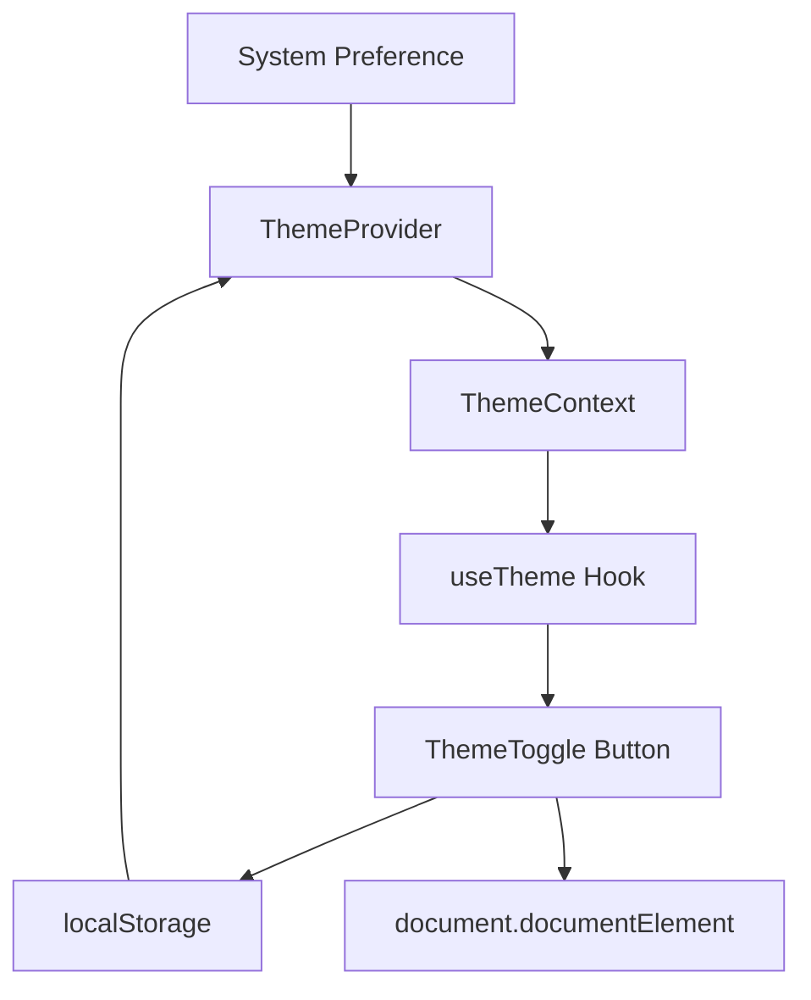

# Documento de Design

## Visão Geral

Este documento descreve o design para implementar um botão de alternância de tema escuro no dashboard. O recurso aproveitará a infraestrutura existente de tema escuro do Tailwind CSS e adicionará um contexto React para gerenciamento de estado, persistência no localStorage e um componente de botão de alternância.

## Arquitetura



O sistema de tema segue uma arquitetura baseada em contexto:
1. **ThemeProvider** inicializa o tema baseado em localStorage ou preferência do sistema
2. **ThemeContext** mantém o estado atual do tema e função de alternância
3. **useTheme** hook fornece acesso ao contexto para componentes
4. **ThemeToggle** componente renderiza o botão e dispara alternâncias

## Componentes e Interfaces

### ThemeContext

```typescript
type Theme = 'light' | 'dark';

interface ThemeContextType {
  theme: Theme;
  toggleTheme: () => void;
  setTheme: (theme: Theme) => void;
}
```

### ThemeProvider

Componente que envolve a aplicação e gerencia o estado do tema:
- Inicializa o tema do localStorage ou preferência do sistema
- Aplica a classe `dark` ao `document.documentElement`
- Persiste mudanças no localStorage

### useTheme Hook

Hook customizado que retorna o contexto de tema:
```typescript
function useTheme(): ThemeContextType
```

### ThemeToggle Component

Componente de botão que:
- Exibe ícone de sol quando tema escuro está ativo
- Exibe ícone de lua quando tema claro está ativo
- Chama `toggleTheme` ao ser clicado
- Inclui estilos de hover para feedback visual

## Modelos de Dados

### Armazenamento no localStorage

```typescript
// Chave: 'theme'
// Valor: 'light' | 'dark'
localStorage.getItem('theme'): string | null
localStorage.setItem('theme', theme: string): void
```

### Estado do Contexto

```typescript
interface ThemeState {
  theme: Theme;
}
```

## Propriedades de Corretude

*Uma propriedade é uma característica ou comportamento que deve ser verdadeiro em todas as execuções válidas de um sistema - essencialmente, uma declaração formal sobre o que o sistema deve fazer. Propriedades servem como ponte entre especificações legíveis por humanos e garantias de corretude verificáveis por máquina.*

### Reflexão sobre Propriedades

Analisando as propriedades identificadas no prework:
- 1.2 e 4.1 são redundantes (ambas testam aplicação da classe CSS) - consolidar em uma propriedade
- 2.1 e 2.2 podem ser combinadas em uma propriedade de round-trip
- 1.1 é uma propriedade de alternância fundamental
- 2.3 testa comportamento padrão do sistema
- 4.3 é uma propriedade de round-trip para serialização

### Propriedade 1: Alternância inverte o tema

*Para qualquer* estado de tema (claro ou escuro), chamar toggleTheme deve resultar no estado oposto.

**Valida: Requisitos 1.1**

### Propriedade 2: Classe CSS reflete o estado do tema

*Para qualquer* tema definido, o elemento raiz do documento deve ter a classe 'dark' se e somente se o tema for escuro.

**Valida: Requisitos 1.2, 4.1**

### Propriedade 3: Round-trip de persistência

*Para qualquer* tema salvo no localStorage, ao inicializar o ThemeProvider, o tema restaurado deve ser equivalente ao tema salvo.

**Valida: Requisitos 2.1, 2.2**

### Propriedade 4: Preferência do sistema como padrão

*Para qualquer* preferência de tema do sistema (claro ou escuro), quando não houver valor no localStorage, o tema inicial deve corresponder à preferência do sistema.

**Valida: Requisitos 2.3**

### Propriedade 5: Serialização round-trip

*Para qualquer* valor de tema válido, serializar para string e deserializar deve produzir o mesmo valor.

**Valida: Requisitos 4.3**

## Tratamento de Erros

| Cenário | Tratamento |
|---------|------------|
| localStorage indisponível | Usar preferência do sistema, não persistir |
| Valor inválido no localStorage | Ignorar e usar preferência do sistema |
| matchMedia não suportado | Usar 'light' como padrão |

## Estratégia de Testes

### Testes Unitários

- Verificar que ThemeToggle renderiza ícone correto para cada tema
- Verificar que clicar no botão chama toggleTheme
- Verificar que ThemeProvider inicializa corretamente

### Testes Baseados em Propriedades

Biblioteca: **Vitest** com **fast-check**

Cada teste de propriedade deve:
- Executar no mínimo 100 iterações
- Ser anotado com referência à propriedade do design
- Formato: `**Feature: dark-theme-toggle, Property {number}: {property_text}**`

Propriedades a testar:
1. Alternância inverte o tema (Propriedade 1)
2. Classe CSS reflete estado (Propriedade 2)
3. Round-trip de persistência (Propriedade 3)
4. Preferência do sistema como padrão (Propriedade 4)
5. Serialização round-trip (Propriedade 5)
