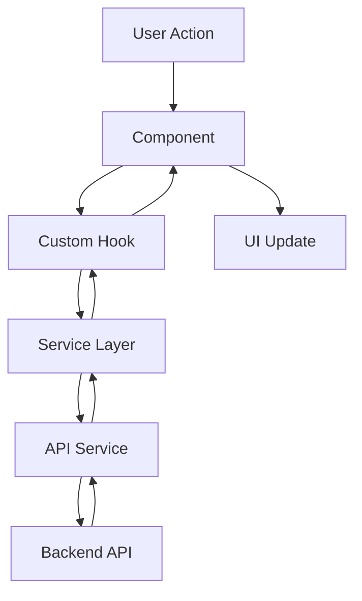

# Design Document: Dashboard Fixes

## Overview

Este documento descreve o design para correção e melhoria do painel de monitoramento climático. As principais mudanças incluem:

1. Separação de rotas para que cada página tenha seu próprio componente
2. Correção da exibição de insights da API
3. Garantia de funcionamento do gráfico de temperatura
4. Implementação de filtros de Estado e Município
5. Criação de páginas dedicadas para Clima e Configurações

## Architecture

O sistema segue uma arquitetura React SPA com as seguintes camadas:

```
┌─────────────────────────────────────────────────────────────┐
│                        App.tsx (Router)                      │
├─────────────────────────────────────────────────────────────┤
│                     Layout Component                         │
│  ┌─────────────┐  ┌────────────────────────────────────┐   │
│  │   Sidebar   │  │           Main Content              │   │
│  │  - Dashboard│  │  ┌──────────────────────────────┐  │   │
│  │  - Clima    │  │  │     Page Components          │  │   │
│  │  - Pokepag. │  │  │  - Dashboard (overview)      │  │   │
│  │  - Usuários │  │  │  - Weather (detailed)        │  │   │
│  │  - Config.  │  │  │  - Explore (Pokepaginação)   │  │   │
│  └─────────────┘  │  │  - Users                     │  │   │
│                   │  │  - Settings                  │  │   │
│                   │  └──────────────────────────────┘  │   │
│                   └────────────────────────────────────┘   │
└─────────────────────────────────────────────────────────────┘
```

### Data Flow



## Components and Interfaces

### New Components

#### 1. Weather Page (`pages/Weather.tsx`)
Página dedicada para visualização detalhada de dados climáticos.

```typescript
interface WeatherPageProps {
  // No props - uses hooks for data
}
```

#### 2. Settings Page (`pages/Settings.tsx`)
Página de configurações do sistema.

```typescript
interface SettingsPageProps {
  // No props - uses context for theme
}
```

#### 3. LocationFilter Component (`components/weather/LocationFilter.tsx`)
Componente para filtrar dados por Estado e Município.

```typescript
interface LocationFilterProps {
  selectedState: string | null
  selectedCity: string | null
  onStateChange: (state: string | null) => void
  onCityChange: (city: string | null) => void
  states: StateOption[]
  cities: CityOption[]
  isLoadingCities?: boolean
}

interface StateOption {
  value: string
  label: string
}

interface CityOption {
  value: string
  label: string
}
```

### Modified Components

#### 1. App.tsx
Atualizar rotas para usar componentes corretos:
- `/weather` → `<Weather />`
- `/settings` → `<Settings />`

#### 2. Sidebar.tsx
Renomear "Explorar" para "Pokepaginação".

#### 3. Dashboard.tsx
Adicionar LocationFilter e passar filtros para hooks.

### Hooks

#### useLocationFilter Hook
```typescript
interface UseLocationFilterResult {
  states: StateOption[]
  cities: CityOption[]
  selectedState: string | null
  selectedCity: string | null
  setSelectedState: (state: string | null) => void
  setSelectedCity: (city: string | null) => void
  isLoadingStates: boolean
  isLoadingCities: boolean
  error: string | null
}
```

#### Updated useWeatherLogs Hook
```typescript
interface WeatherLogsQuery {
  page?: number
  limit?: number
  startDate?: string
  endDate?: string
  city?: string
  state?: string  // New parameter
}
```

## Data Models

### Existing Types (No Changes)
- `WeatherLog`
- `WeatherInsights`
- `PaginatedResponse<T>`

### New Types

```typescript
interface BrazilianState {
  id: number
  sigla: string
  nome: string
}

interface BrazilianCity {
  id: number
  nome: string
  stateId: number
}

interface LocationFilterState {
  selectedState: string | null
  selectedCity: string | null
}
```

## Correctness Properties

*A property is a characteristic or behavior that should hold true across all valid executions of a system-essentially, a formal statement about what the system should do. Properties serve as the bridge between human-readable specifications and machine-verifiable correctness guarantees.*

### Property 1: InsightsPanel renders all required data fields
*For any* valid WeatherInsights object, the InsightsPanel component SHALL render all required fields: statistics (avgTemperature, maxTemperature, minTemperature, avgHumidity, avgWindSpeed), trends (temperatureTrend, humidityTrend), classification, alerts array, comfortScore, and summary.

**Validates: Requirements 2.2, 2.3, 2.4, 2.5, 2.6**

### Property 2: Chart renders correct data points
*For any* non-empty array of WeatherLog objects, the temperature chart SHALL render exactly one data point per log entry, with the x-axis showing formatted time and y-axis showing temperature values within the min/max range of the data.

**Validates: Requirements 3.1, 3.2, 3.3**

### Property 3: Location filter cascading behavior
*For any* selected state, the cities dropdown SHALL only contain cities that belong to that state. When a state changes, the selected city SHALL be reset to null.

**Validates: Requirements 4.2, 4.3, 4.4**

### Property 4: Settings persistence
*For any* setting change (theme, auto-refresh interval), the change SHALL be persisted to localStorage and immediately reflected in the UI without requiring a page refresh.

**Validates: Requirements 6.3**

## Error Handling

### API Errors
- Display user-friendly error messages in Portuguese
- Maintain previous state when filter API calls fail
- Show loading indicators during data fetching
- Log errors to console for debugging

### Edge Cases
- Empty data: Show "Sem dados disponíveis" message
- Null insights: Show placeholder content
- Network errors: Show retry option
- Invalid filter combinations: Reset to default state

## Testing Strategy

### Property-Based Testing Library
- **Vitest** with **fast-check** for property-based testing in the React/TypeScript dashboard

### Unit Tests
Unit tests will cover:
- Component rendering with various props
- Hook behavior with mocked API responses
- Route navigation
- Error state handling

### Property-Based Tests
Property tests will verify:
1. **InsightsPanel data rendering** - Generate random valid WeatherInsights and verify all fields are rendered
2. **Chart data point rendering** - Generate random WeatherLog arrays and verify correct number of data points
3. **Location filter cascading** - Generate random state/city combinations and verify correct filtering
4. **Settings persistence** - Generate random setting values and verify localStorage persistence

### Test Configuration
- Minimum 100 iterations per property test
- Each property test tagged with: `**Feature: dashboard-fixes, Property {number}: {property_text}**`

### Test Files Structure
```
dashboard/src/
├── pages/
│   ├── Weather.test.tsx
│   └── Settings.test.tsx
├── components/weather/
│   ├── LocationFilter.test.tsx
│   └── LocationFilter.property.test.tsx
└── hooks/
    └── useLocationFilter.test.tsx
```

